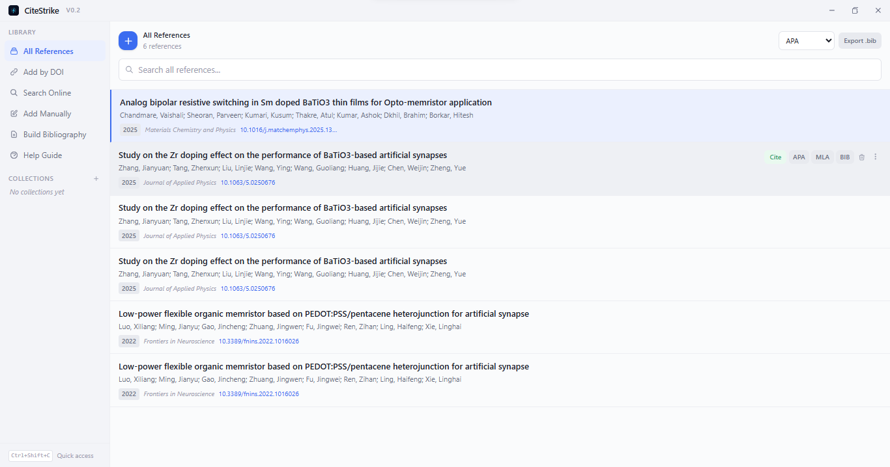
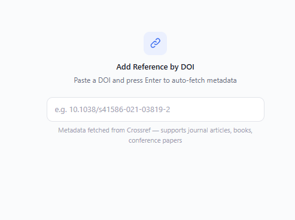
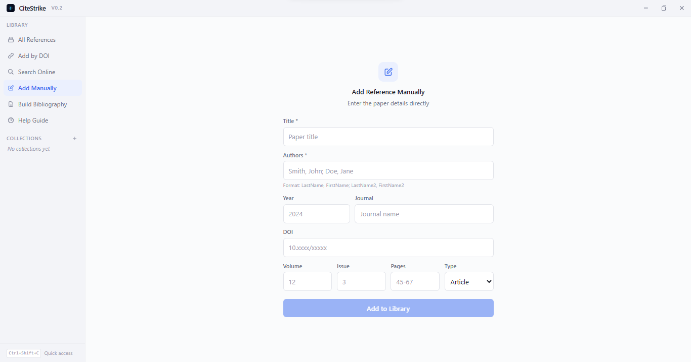
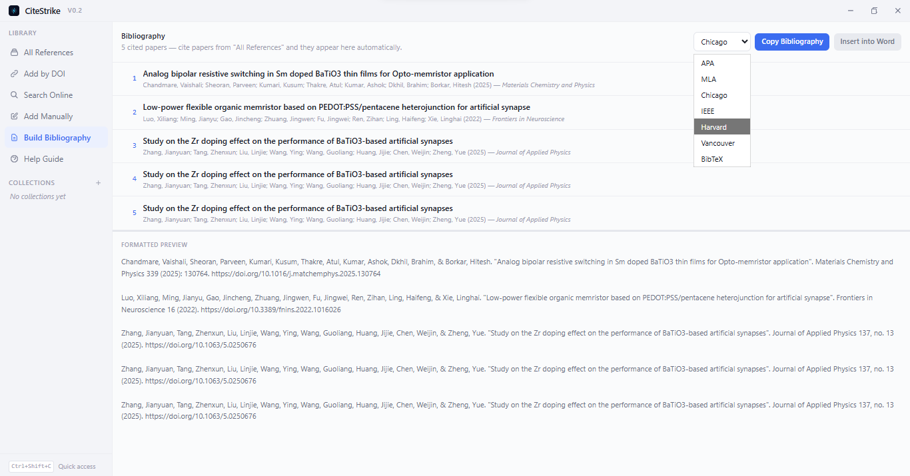
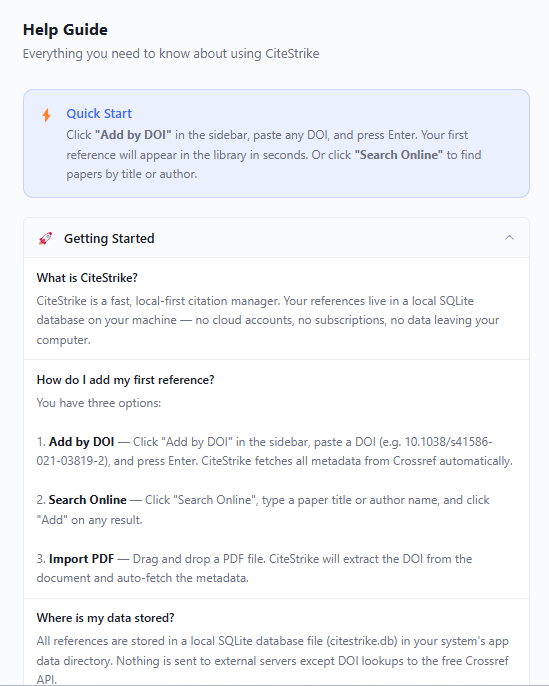

<div align="center">


<br/>
<br/>

**The Raycast of reference management — cite papers in any app with one keystroke.**

[![Windows][Windows-image]][download-url]
[![Rust][Rust-image]](#tech-stack)
[![Tauri][Tauri-image]](#tech-stack)
[![Svelte][Svelte-image]](#tech-stack)
[![License][License-image]](#license)

[Download Latest Release][download-url] | [Report Bug](https://github.com/hasnain7abbas/citestrike/issues) | [Request Feature](https://github.com/hasnain7abbas/citestrike/issues)

[Windows-image]: https://img.shields.io/badge/-Windows-0078D4?style=for-the-badge&logo=windows11&logoColor=white
[Rust-image]: https://img.shields.io/badge/-Rust-000000?style=for-the-badge&logo=rust&logoColor=white
[Tauri-image]: https://img.shields.io/badge/-Tauri-24C8DB?style=for-the-badge&logo=tauri&logoColor=white
[Svelte-image]: https://img.shields.io/badge/-Svelte_5-FF3E00?style=for-the-badge&logo=svelte&logoColor=white
[License-image]: https://img.shields.io/badge/-MIT-22c55e?style=for-the-badge
[download-url]: https://github.com/hasnain7abbas/citestrike/releases/latest

<br/>

<a href="https://github.com/hasnain7abbas/citestrike/releases/latest"></a>


</div>

<br/>

## The Problem

Citation managers like Zotero, Mendeley, and EndNote are **bloated, slow, and break your flow**. Every citation requires switching windows, navigating a clunky GUI, copying text, switching back, and pasting. For a thesis with 200+ references, you lose *hours* to this friction.

## The Solution

**CiteStrike** sits silently in the background using **< 15 MB RAM**. Press one hotkey from *anywhere*:

<p align="center">
  <kbd>Ctrl</kbd> + <kbd>Shift</kbd> + <kbd>C</kbd>
</p>

Your library appears instantly. Search, cite, paste. The formatted citation lands in your clipboard — or directly into Word. **No window switching. No friction. No cloud. No subscriptions.**

---

## Screenshots

<div align="center">

### Library & One-Click Cite

*Your entire reference library with instant search, one-click cite, and quick-copy buttons for APA, MLA, and BibTeX.*



<br/><br/>

<table>
<tr>
<td width="50%">

### Add by DOI

*Paste any DOI and press Enter. CiteStrike fetches complete metadata from Crossref automatically.*



</td>
<td width="50%">

### Add Manually

*No DOI? Enter paper details directly — title, authors, year, journal, volume, issue, pages, and type.*



</td>
</tr>
</table>

<br/>

### Auto Bibliography

*Cite papers from your library and they automatically appear here. Switch between 7 citation styles, preview the formatted output, and copy or insert into Word with one click.*



<br/><br/>

### Built-in Help Guide

*Everything you need to know about CiteStrike — quick start, keyboard shortcuts, data & privacy, and more.*



</div>

---

## Features

<table>
<tr>
<td>

### Import

- **Drag & Drop PDFs** — DOI extracted automatically
- **Paste DOI** — metadata fetched from Crossref
- **Search Crossref** — find papers by title or author
- **Manual Entry** — fill in metadata yourself
- **Bulk Import** — drop multiple PDFs at once

</td>
<td>

### Cite

- **One-Click Cite** — copies in-text citation to clipboard
- **7 Styles** — APA, MLA, Chicago, IEEE, Harvard, Vancouver, BibTeX
- **Rich Text** — italics preserved when pasting into Word
- **Citation Tracking** — numbered badges show cite order
- **Global Hotkey** — <kbd>Ctrl+Shift+C</kbd> from any app

</td>
</tr>
<tr>
<td>

### Organize

- **Instant Search** — full-text search with zero lag
- **Collections** — color-coded folders
- **Inline Edit** — modify metadata without leaving the library
- **Delete with Confirm** — trash icon with confirmation dialog
- **Export .bib** — full library as BibTeX file

</td>
<td>

### Output

- **Auto Bibliography** — cited papers listed automatically
- **Live Preview** — see formatted output before copying
- **Copy Bibliography** — one click, rich text clipboard
- **Insert into Word** — paste directly at cursor
- **Insert into PowerPoint** — same for presentations

</td>
</tr>
</table>

---

## How It Works

```
   ┌─────────────────┐        ┌──────────────────┐
   │  Drop PDF  /    │        │  Paste DOI  /    │
   │  Search Online   │        │  Add Manually    │
   └────────┬────────┘        └────────┬─────────┘
            │                          │
            ▼                          ▼
   ┌──────────────────────────────────────────────┐
   │            Crossref Metadata Fetch            │
   └────────────────────┬─────────────────────────┘
                        ▼
   ┌──────────────────────────────────────────────┐
   │          Local SQLite Library                 │
   │   (search, organize, edit, delete)            │
   └────────────────────┬─────────────────────────┘
                        ▼
   ┌──────────────────────────────────────────────┐
   │         Click "Cite" on a Paper               │
   │   • In-text citation → clipboard              │
   │   • Paper marked as cited with badge          │
   │   • Toast: "Copied: (Smith et al., 2024)"    │
   └────────────────────┬─────────────────────────┘
                        ▼
   ┌──────────────────────────────────────────────┐
   │       "Build Bibliography" View               │
   │   • All cited papers listed automatically     │
   │   • Formatted preview (APA/IEEE/etc.)         │
   │   • Copy or Insert into Word                  │
   └──────────────────────────────────────────────┘
```

---

## Download

Head to the [**Releases**](https://github.com/hasnain7abbas/citestrike/releases/latest) page and grab the latest installer:

| File | Description |
|------|-------------|
| `CiteStrike_x.x.x_x64_en-US.msi` | Standard Windows installer (recommended) |
| `CiteStrike_x.x.x_x64-setup.exe` | NSIS installer |

> **Requirements:** Windows 10/11 (x64). No other dependencies needed.

---

## Quick Start

1. **Install** — Download and run the installer
2. **Add papers** — Click the **`+`** button, drag PDFs, paste a DOI, or search Crossref
3. **Cite** — Click **Cite** on any reference. The in-text citation is copied to your clipboard
4. **Paste** — Switch to your document and press <kbd>Ctrl+V</kbd>
5. **Bibliography** — Click **Build Bibliography** in the sidebar. All cited papers appear automatically. Copy the formatted bibliography and paste it at the end of your document.

### Keyboard Shortcuts

| Shortcut | Action |
|----------|--------|
| <kbd>Ctrl+Shift+C</kbd> | Toggle CiteStrike window (global — works from any app) |
| <kbd>↑</kbd> / <kbd>↓</kbd> | Navigate references in the library |
| <kbd>Enter</kbd> | Submit search, DOI, or form |

---

## Office Add-in

CiteStrike includes a **built-in Office Web Add-in** for Microsoft Word and PowerPoint — no separate install needed.

1. CiteStrike runs a local API server on `localhost:27182` automatically
2. Download the manifest from `http://localhost:27182/manifest.xml`
3. In Word/PowerPoint: **Insert > Get Add-ins > Upload My Add-in** > select the manifest
4. The CiteStrike panel appears in the Home ribbon — search and insert citations at your cursor

---

## Tech Stack

<table>
<tr>
<th>Backend (Rust)</th>
<th>Frontend (Svelte)</th>
</tr>
<tr>
<td>

| Crate | Purpose |
|---|---|
| **Tauri v2** | Native desktop shell (~5 MB) |
| **rusqlite** | Local SQLite database |
| **lopdf** | PDF text extraction & DOI parsing |
| **reqwest + tokio** | Async Crossref API calls |
| **axum** | HTTP server for Office add-in |
| **clipboard-win** | RTF clipboard (rich text) |
| Custom engine | 7 citation style formatters |

</td>
<td>

| Library | Purpose |
|---|---|
| **SvelteKit** | Zero-overhead compiled UI |
| **Svelte 5 Runes** | Fine-grained reactivity |
| **Tailwind CSS v4** | Modern styling + dark mode |
| **Tauri API** | IPC bridge to Rust backend |

</td>
</tr>
</table>

---

## Architecture

```
┌──────────────────────────────────────────────────────┐
│                   CiteStrike App                      │
│               (runs in background)                    │
└──────────┬────────────────────────┬──────────────────┘
           │  Ctrl+Shift+C         │  localhost:27182
           ▼                       ▼
┌─────────────────────┐  ┌─────────────────────────────┐
│  Svelte UI          │  │  Office Web Add-in          │
│  (Tailwind + Runes) │  │  (Word & PowerPoint panel)  │
└──────────┬──────────┘  └──────────┬──────────────────┘
           │  IPC (Tauri)           │  REST API (axum)
           └──────────┬─────────────┘
                      ▼
┌──────────────────────────────────────────────────────┐
│              Rust Core Engine                         │
│                                                      │
│  ┌──────────┐  ┌──────────┐  ┌───────────────────┐  │
│  │  SQLite  │  │  PDF     │  │  Crossref          │  │
│  │  Store   │  │  Parser  │  │  API Client        │  │
│  └──────────┘  └──────────┘  └───────────────────┘  │
│  ┌────────────────────┐  ┌────────────────────────┐  │
│  │  Citation Engine   │  │  RTF Clipboard         │  │
│  │  (7 styles)        │  │  (rich text copy)      │  │
│  └────────────────────┘  └────────────────────────┘  │
└──────────────────────────────────────────────────────┘
```

---

## Development

### Prerequisites

- [Rust](https://rustup.rs/) (via `rustup`)
- [Node.js](https://nodejs.org/) v18+
- [Tauri v2 Prerequisites](https://v2.tauri.app/start/prerequisites/)

### Run Locally

```bash
git clone https://github.com/hasnain7abbas/citestrike.git
cd citestrike
npm install
npx tauri dev
```

### Build for Production

```bash
npx tauri build
```

Output: `src-tauri/target/release/bundle/`

---

## CI/CD

| Workflow | Trigger | What it does |
|----------|---------|--------------|
| **CI** | Push / PR to `main` | Frontend build, TypeScript checks, Rust compilation |
| **Release** | Push to `main` | Auto-bumps version, builds `.msi` + `.exe`, publishes GitHub Release |

Every push to `main` automatically creates a new release with installers attached.

---

## Roadmap

- [x] Tauri v2 project with SQLite CRUD
- [x] PDF drag-and-drop import with DOI extraction
- [x] Crossref API integration (DOI lookup + search)
- [x] Global hotkey (<kbd>Ctrl+Shift+C</kbd>)
- [x] 7 citation styles (APA, MLA, Chicago, IEEE, Harvard, Vancouver, BibTeX)
- [x] Rich text clipboard (RTF with preserved italics)
- [x] One-click cite with citation tracking & badges
- [x] Auto-generated bibliography from cited papers
- [x] Manual reference entry & inline editing
- [x] Library export to `.bib`
- [x] Office Web Add-in for Word & PowerPoint
- [x] Collection/folder management with colors
- [x] Dark mode (follows system preference)
- [x] Delete references with confirmation dialog
- [x] CI/CD pipeline with auto-releases
- [ ] CSL (Citation Style Language) file support
- [ ] System tray with background mode
- [ ] Google Docs integration
- [ ] Duplicate detection
- [ ] BibTeX file import

---

## Contributing

Contributions are welcome! If you'd like to help kill bloated reference managers:

1. Fork the repository
2. Create your feature branch (`git checkout -b feature/amazing-feature`)
3. Commit your changes (`git commit -m 'Add amazing feature'`)
4. Push to the branch (`git push origin feature/amazing-feature`)
5. Open a Pull Request

---

## License

Distributed under the **MIT License**. See [`LICENSE`](LICENSE) for more information.

---

<div align="center">

### Made by [Hasnain Abbas](https://github.com/hasnain7abbas)

[](https://github.com/hasnain7abbas)
[](mailto:hsnanrzee1160@gmail.com)

<br/>

<sub>Built with Rust, Tauri, and a deep hatred for slow citation managers.</sub>

</div>
